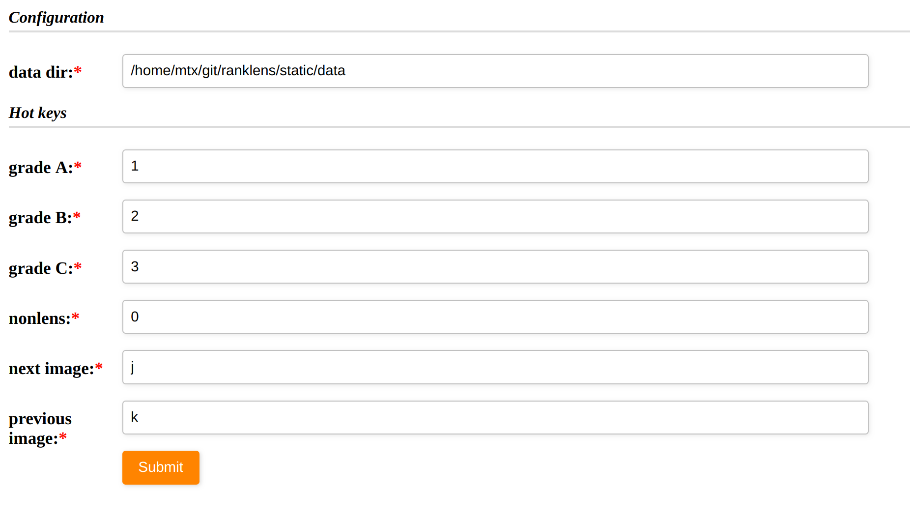
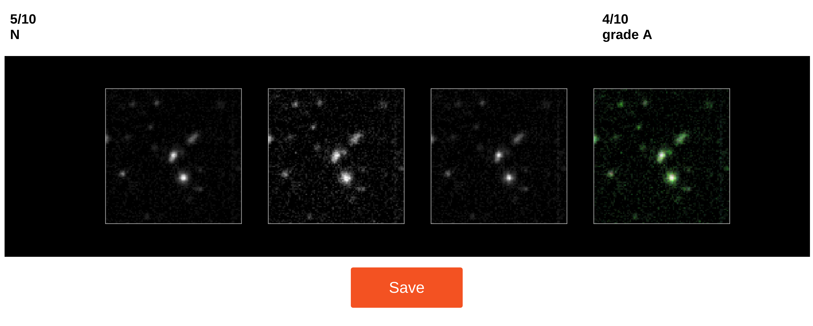

### install
```
pip install -r requirements.txt
```

### usage
This script is used to label png files. When use it, you should put the png data in `static/` directory or create a link like:
```
ln -s your/data/path static/data
```
Then, run the script by
```
phython server.py
```
and open http://127.0.0.1:5000/ in your browser.

### configuration
When you first use this script, the main page will redirect to the configuration page. And you can open this page by http://127.0.0.1:5000/conf at any time.

In this page, you should set the data directory and some hotkeys. The default value is:

| key          |  result            |
| ------------ | -------------------|
| `1`          | label as 1 (grade A)|
| `2`          | label as 2 (grade B)|
| `3`          | label as 3 (grade C)|
| `0`          | label as 0 (nonlens)|
| `j`          | show next image    |
| `k`          | show previous image|

Note that, when you press `j` or `k`, if the image has not been labelled, is will be labelled as `0`, otherwise the original value will be reserved.

The result saved in `data/result/rank.txt`


### label
After configuration, you can label image in http://127.0.0.1:5000/work

